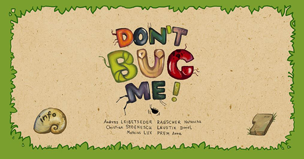

# DontBugMe

---

This game is the result of the 2nd Klagenfurt Game Jam 2015 (#klujam). It's a 1 Keyboard Multiplayer Game that features energetic bugs, racing each other on a single screen. The Bugs are named and modelled after Austrian skiing athletes - Andi Goldi, Marcel Hirschi, Raini Schöni, Mario Scheibi & Marlies Schildi. They are controlled by up to 5 players with a single key for each. These keys are randomly changing all the time so the players have to be quick to find their currently assigned one on the keyboard - Don't bug your opponents! Pressing the right keys gives the bugs an energy boost, failing to do so results in the bug falling behind and eventually below the screen, which means the game is lost for that player. The last bug on the screen wins.

Play the game online on [github.io](https://amplejoe.github.io/DontBugMe/).

This work is licensed under the [Creative Commons Attribution-NonCommercial 4.0 International License](http://creativecommons.org/licenses/by-nc/4.0/).

## Team

The game was initially developed by (alphabetic order):

* Andreas Leibetseder ([github.com/amplejoe](https://github.com/amplejoe))
* Daniel Leustik
* Natascha Rauscher
* Anna Prem ([www.annaprem.at](http://www.annaprem.at))
* Christian Stoenescu

## Controls

* ENTER/SPACEBAR advances between title & menu screens.
* Clicking on 'Info' or pressing 'I' on the Title Screen opens this an information page.
* Use 'ABCDEFGHIJKLMNOPQRSTUVWXYZ' to control your bug.
* Before the race starts (after go) all players MUST at least once have pressed their corresponding keys. In this phase the keys change after a certain interval - so be quick to find your button!

On the Game Over Screen you can navigate with the arrow keys (LEFT, RIGHT, UP, DOWN). You can add your name to the high score (note: currently local browser storage only!) by typing in several characters (at least 3), selecting the green check mark with the LEFT/RIGHT arrow button and press ENTER/SPACEBAR to confirm. An entry will be cancelled by selecting the X mark respectively. After you have made your choice you can choose to display the current high score in a new tab by selecting 'Show Highscore' using the UP/DOWN arrows or select a 'New Game' once again pressing ENTER/SPACEBAR.

## Technology

The Game was written in Phaser, a HTML 5 media framework based on JavaScript. IDEAs WebStorm was used as an IDE and all Classes were written in TypeScript, which is a free open source programming language developed and maintained by Microsoft. Typescript is a superset of JavaScript and aims at making JavaScript programming more object-oriented.

## How to compile and run

Clone it from the github repo (or fork, download ZIP, whatever you prefer). Then make sure you've got [node.js](https://nodejs.org/en/) and [typescript](http://www.typescriptlang.org/) installed. Btw. it's much easier to install node.js first ;) From there it's easy if you are a Windows user:

1. Run compile_ts.cmd
2. Run create_dist.cmd
3. Use the files from the dist directory.

If you are not on Windows, then follow the commands in these files (it's mostly copying around files, changing a particular link in the index.html file and you can leave out the minifying command)

## Known Issues

Sometimes key combinations cannot be recognized simultaneously, only individually. This is due to the fact that many keyboards are unable to process certain combinations of keys due to hardware limitations known as ghosting - you can check your keyboards limitations at [Microsoft's Ghosting Demo](http://www.microsoft.com/appliedsciences/KeyboardGhostingDemo.mspx). If this happens at the start of the race, just release some of the keys and input the key combination sequentially or wait for the game to switch to a different combination.
Firefox and Opera encounter sound problems.
